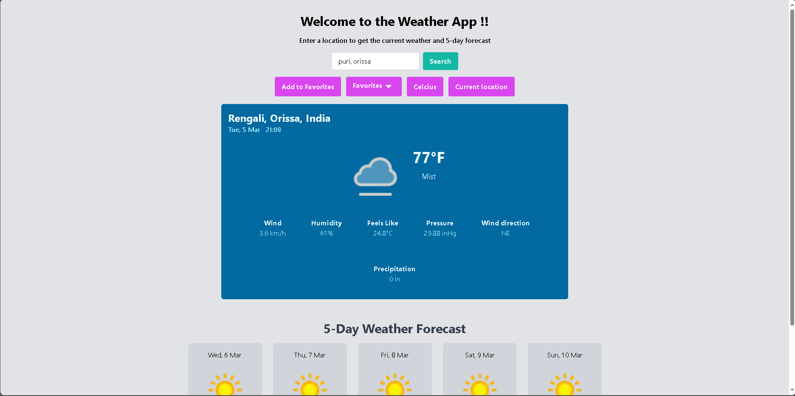
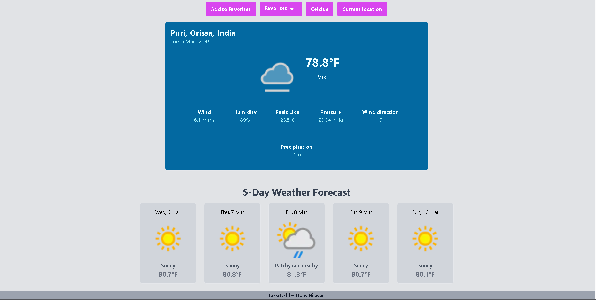
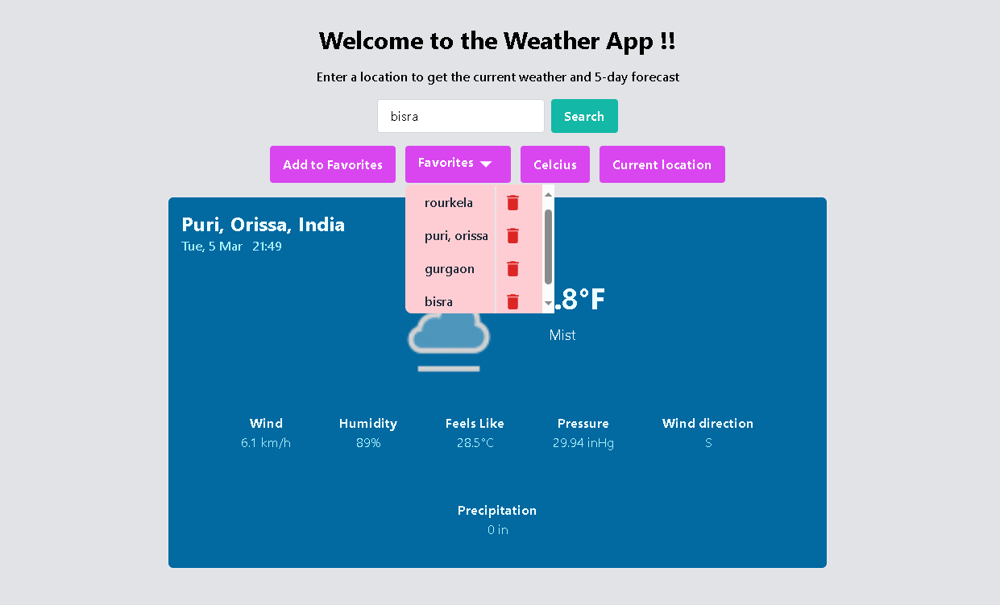

# Weather - App

## Description
The Weather App is a web application that allows users to search for weather information based on location. It provides current weather data and a 5-day weather forecast. Users can also add locations to their favorites list and switch between Celsius and Fahrenheit for temperature units.

## How to Run Locally
1. Clone the repository: `git clone https://github.com/uday-biswas/weather-app.git`
2. Open the terminal inside the main folder and run these commands to install dependencies:
```
cd frontend
npm install
cd ../backend
npm install 
cd ..
```
3. Create a `.env` file inside the frontend folder and define the frontend url:
```
REACT_APP_BASE_URL=http://localhost:4000/api/v1
```
4. Then create a `.env` file inside the backend folder and define the following:
```
PORT_BACKEND=4000
FRONTEND_URL=http://localhost:3000
WEATHER_API_KEY = YOUR_WEATHERAPI_KEY
```
4. Start the frontend as well as backend with the following commands : 
```
npm run dev
```
or
```
cd backend
npm run server 
cd ../frontend
npm start
```
5. Open your browser and navigate to `http://localhost:3000`

Landing Page:


## Features
- Get weather data for user current location
- Search for weather data based on location
- View current weather information and 5-day weather forecast:


- Add locations to favorites list


- Switch between Celsius and Fahrenheit temperature units by clicking the button

## Usage
1. Enter a location in the search bar and press Enter or click the Search button.
2. View the current weather information and 5-day weather forecast for the location.
3. Click the Add to Favorites button to add a location to your favorites list.
4. Click the Favorites button to view and select locations from your favorites list.
5. Use the Celcius/Fahrenheit button to switch between temperature units.
6. Click the Current location button to get weather data for your current location.

## Technologies Used
- React
- Tailwind CSS
- Nodejs
- weatherApi
- expressjs

## Deployment

- The frontend is deployed in vercel. [Link](https://weather-app-loco.vercel.app/) :point_left:
- The backend is deployed in render. [Link](https://weather-app-gar8.onrender.com) :point_left:

## Getting Started
- Follow the live demo links above and enjoy the site.

### Prerequisites

- A modern browser, up to date.  :muscle:

## Author

👤 Uday Biswas
- Github: [@UdayBiswas](https://github.com/uday-biswas) 
- Linkedin: [@UdayBiswas](https://www.linkedin.com/in/udaybiswas944/)  

## Show your support

Give a ⭐️ if you like this project!

